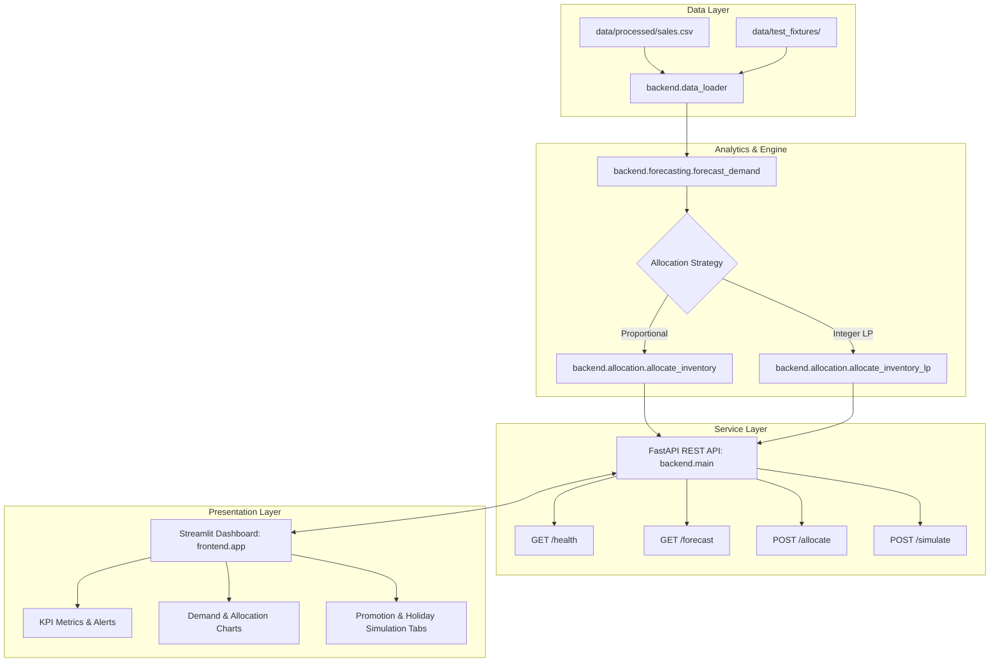

# Inventory-Constrained Demand Forecasting & Allocation

An enterprise-grade, deterministic retail supply-chain decision-support system that models multi-store seasonal demand, evaluates promotional and holiday uplifts, and allocates scarce inventory using proportional largest-remainder integer distribution and integer linear programming (PuLP).

---

## 1. Project Title

**Inventory-Constrained Demand Forecasting & Allocation System**  
*Repository:* `jos151/HTH016ML04` | *Platform:* Python 3.10+ / FastAPI / Streamlit / PuLP

---

## 2. Problem Statement

Retail distribution networks frequently encounter severe central warehouse supply constraints where total consumer demand across regional retail locations substantially exceeds available inventory ($\sum \text{Demand}_s > \text{Supply}$). Traditional independent store ordering leads to:
1. **First-Come, First-Served Starvation:** Stores ordering first deplete central stocks, leaving other locations with 100% stockouts.
2. **Fractional Allocation Infeasibility:** Simple percentage formulas allocate fractional pallets/cases (e.g., $416.67$ units), which physical warehouse pickers cannot pick or pack without rounding distortions.
3. **Capacity Overshoot:** Uncoordinated rounding causes total allocated units to exceed physical supply ($\sum \text{Allocated}_s > \text{Supply}$).
4. **Phantom Stockouts:** Promotional marketing campaigns and holiday events drive localized demand surges that amplify stockouts without visibility into system-wide trade-offs.

---

## 3. Simple Explanation

Imagine a central warehouse with **1,000 units** of a popular SKU. Three retail stores forecast demand for the upcoming week:
- **Store A** expects **500 units**
- **Store B** expects **400 units**
- **Store C** expects **300 units**
- *Total Network Demand:* **1,200 units** (Deficit / Shortage: **200 units**)

If we allocate naively:
- Store A gets $\frac{500}{1200} \times 1000 = 416.67 \to 417$
- Store B gets $\frac{400}{1200} \times 1000 = 333.33 \to 333$
- Store C gets $\frac{300}{1200} \times 1000 = 250.00 \to 250$

The largest-remainder algorithm allocates the integer floors ($416 + 333 + 250 = 999$) and gives the single remaining unit to Store A (which has the largest fractional remainder of $0.67$). Total allocated is **exactly 1,000 units**, total shortage is **200 units**, no store receives more than its demand, and no units are fractionally divided.

---

## 4. Solution Overview

This system provides a full end-to-end software suite:
- **Clean Ingestion & Grid Completion:** Validates raw POS transactions, cleans dates, filters entities, and completes sparse time-series grids with zero-imputation.
- **Hierarchical Demand Forecasting:** Computes a 7-day baseline moving average, decomposes day-of-week seasonality, applies promotional multipliers and holiday uplifts, and falls back gracefully for cold-start series.
- **Deterministic Constrained Allocation:** Implements largest-remainder proportional distribution as well as an integer linear programming (MILP) optimization engine.
- **Validated REST API:** FastAPI service exposing `/health`, `/forecast`, `/allocate`, and `/simulate` endpoints.
- **Interactive Decision Dashboard:** Streamlit frontend providing real-time KPI metrics, bar charts, shortage warnings, and before-and-after scenario simulations.

---

## 5. Architecture



---

## 6. Dataset Requirements

To ensure analytical integrity and prevent memory exhaustion during hackathon evaluations, the core retail dataset must satisfy:
- **Store Entities:** Exactly **5 stores** (`STORE_1` through `STORE_5`).
- **Product Entities:** Exactly **10 SKUs** (`SKU_01` through `SKU_10`).
- **Time Horizon:** At least 90 consecutive days (the packaged dataset contains **731 days** from `2022-01-01` to `2024-01-01`).
- **Long-Format Granularity:** Exactly one record per `date`, `store_id`, and `sku_id` combination.
- **Total Records:** Exactly $731 \times 5 \times 10 = 36,550$ rows.

---

## 7. Dataset Source

- Source data was derived from genuine retail point-of-sale inventory records located at `data/raw/retail_store_inventory.csv`.
- The dataset was processed using [`scripts/prepare_dataset.py`](file:///D:/HTH016ML04/scripts/prepare_dataset.py) into clean normalized CSV tables under [`data/processed/`](file:///D:/HTH016ML04/data/processed/):
  - `sales.csv` (Primary transactional demand series)
  - `calendar.csv` (Date attributes, day-of-week, holidays)
  - `promotions.csv` (Promotional event flags and multipliers)
  - `inventory.csv` (Store-level starting stock levels)
  - `products.csv` (SKU metadata, categories, prices)
  - `stores.csv` (Store locations, types, and regions)

---

## 8. Real Versus Synthetic Data Clarification

| Data Domain | File Location | Nature | Purpose |
|---|---|---|---|
| **Production / Evaluation Data** | `data/processed/sales.csv` | **Real Retail Data** | Historical POS transactions used for baseline model forecasting, seasonal decomposition, and API execution. |
| **Testing Fixtures** | `data/test_fixtures/*.csv` | **Synthetic Test Data** | Deterministic boundary cases (e.g. zero inventory, dominant store, tie-breaking, invalid records) clearly labeled with `data_type="SYNTHETIC_TEST_DATA"`. |

---

## 9. Data Schemas

### Input Schema (`sales.csv`)
| Column | Type | Nullable | Description |
|---|---|---|---|
| `date` | String (ISO `YYYY-MM-DD`) | No | Transaction date |
| `store_id` | String | No | Unique store identifier (e.g. `STORE_1`) |
| `sku_id` | String | No | Unique product identifier (e.g. `SKU_01`) |
| `units_sold` | Float / Int | No | Non-negative physical units sold |
| `is_promo` | Integer (`0` or `1`) | Yes | Promotional event indicator |
| `promo_multiplier` | Float ($\ge 1.0$) | Yes | Promotion uplift factor (default 1.0) |
| `is_holiday` | Integer (`0` or `1`) | Yes | Public or calendar holiday indicator |

### Forecast Output Schema
| Column | Type | Description |
|---|---|---|
| `store_id` | String | Store identifier |
| `sku_id` | String | Product identifier |
| `forecast_date` | String (ISO `YYYY-MM-DD`) | Future projection date |
| `baseline_units` | Float | 7-day seasonal baseline before external uplifts |
| `promo_multiplier` | Float | Store promotional factor applied |
| `holiday_multiplier` | Float | Holiday factor applied (1.15 if holiday week) |
| `predicted_units` | Float | Final non-negative predicted demand |

### Allocation Output Schema
| Column | Type | Description |
|---|---|---|
| `store_id` | String | Store identifier |
| `forecasted_demand` | Integer | Total store forecasted demand across SKUs |
| `allocated_units` | Integer | Physical integer units allocated from supply |
| `shortage` | Integer | Unfulfilled demand ($\max(0, \text{demand} - \text{allocated})$) |
| `excess` | Integer | Overstock units ($\max(0, \text{allocated} - \text{demand})$) |

---

## 10. Data Preprocessing

Implemented in [`backend/data_loader.py`](file:///D:/HTH016ML04/backend/data_loader.py):
1. **Schema Validation:** Verifies mandatory base columns (`date`, `store_id`, `sku_id`, `units_sold`).
2. **Identifier Sanity:** Rejects blank or null store and SKU values.
3. **Robust Date Parsing:** Utilizes `format="mixed"` to safely standardize mixed ISO and slash dates (`YYYY-MM-DD`, `YYYY/MM/DD`) into ISO-8601 strings.
4. **Non-Negativity Enforcement:** Coerces `units_sold` to numeric and raises `ValueError` on negative values.
5. **Duplicate Prevention:** Detects and rejects duplicate `(date, store_id, sku_id)` rows.
6. **Cartesian Grid Completion:** Constructs the full Cartesian product ($\text{Dates} \times \text{Stores} \times \text{SKUs}$) and imputes missing historical sales with `0.0`.
7. **Deterministic Sorting:** Orders output deterministically by `store_id`, `sku_id`, and `date`.

---

## 11. Forecasting Method

Implemented in [`backend/forecasting.py`](file:///D:/HTH016ML04/backend/forecasting.py):
1. **Baseline Calculation:** Calculates the unweighted mean demand over the most recent 7 historical observations for each store-SKU group:
   $$\bar{y}_{s,k} = \frac{1}{7} \sum_{t=T-6}^{T} y_{s,k,t}$$
2. **Day-of-Week Seasonality:** Computes empirical seasonal factors $\gamma_{s,k,w}$ for day of week $w \in \{0, \dots, 6\}$:
   $$\gamma_{s,k,w} = \frac{\bar{y}_{s,k,w}}{\bar{y}_{s,k}} \quad (\text{clipped to } [0.5, 2.0])$$
3. **Cold-Start Fallback:** If a time series contains fewer than 7 observations, the model automatically cascades through historical series mean $\to$ store mean $\to$ SKU mean $\to$ global mean. Output is guaranteed to contain zero `NaN` or infinite values.

---

## 12. Promotion Logic

- Applied through the `promo_boost` parameter dictionary (e.g. `{"STORE_1": 1.30}`).
- Scales the unboosted seasonal baseline multiplicatively:
  $$\hat{y}_{s,k,t}^{\text{promo}} = \hat{y}_{s,k,t}^{\text{base}} \times M_{\text{promo}, s}$$
- **Isolation Guarantee:** Promotional uplifts apply strictly to targeted stores; unpromoted stores remain unchanged.

---

## 13. Holiday Logic

- Configured via the `is_holiday_week: bool` toggle.
- When `True`, applies a universal $+15\%$ uplift multiplier ($1.15$) across all store series:
  $$\hat{y}_{s,k,t}^{\text{hol}} = \hat{y}_{s,k,t}^{\text{base}} \times 1.15$$
- **Combined Effect:** If both promotional boost and holiday week are enabled, both multipliers combine multiplicatively:
  $$\hat{y}_{s,k,t} = \hat{y}_{s,k,t}^{\text{base}} \times M_{\text{promo}, s} \times 1.15$$

---

## 14. Allocation Method

Implemented in [`backend/allocation.py`](file:///D:/HTH016ML04/backend/allocation.py):

### Strategy A: Proportional Allocation (`method="proportional"`)
- Distributes available inventory $S$ in proportion to store demand share:
  $$q_s = \frac{d_s}{\sum_{i} d_i} \times S$$
- When $S \ge \sum d_i$, every store receives exactly $d_s$, and surplus inventory remains in the central warehouse.

### Strategy B: Integer Linear Programming (`method="lp"`)
- Formulates a Mixed-Integer Linear Program (MILP) solved using **PuLP** (`PULP_CBC_CMD`):
  $$\min \sum_{s \in \mathcal{S}} \left( 1.0 \cdot \text{shortage}_s + 0.3 \cdot \text{excess}_s \right)$$
  $$\text{s.t.} \quad \sum_{s} \text{allocated}_s \le S, \quad \text{allocated}_s - d_s = \text{excess}_s - \text{shortage}_s, \quad \text{allocated}_s \in \mathbb{Z}_{\ge 0}$$
- Strictly prevents overstock by default ($\text{allocated}_s \le d_s$).

---

## 15. Integer-Rounding Method (Largest Remainder)

To convert exact continuous proportional quotas $q_s$ into whole physical integer units without bias:
1. Compute integer floors: $I_s = \lfloor q_s \rfloor$.
2. Calculate fractional remainders: $r_s = q_s - I_s$.
3. Determine remaining units to distribute: $R = S - \sum_s I_s$.
4. Sort stores by remainder $r_s$ descending (breaking ties deterministically by `store_id`).
5. Add $+1$ unit to the top $R$ stores:
   $$\text{allocated}_s = \begin{cases} I_s + 1, & \text{if store } s \text{ is in top } R \\ I_s, & \text{otherwise} \end{cases}$$
- **Guarantee:** $\sum \text{allocated}_s \equiv \min(S, \sum d_s)$ exactly.

---

## 16. API Endpoints

FastAPI service documented at [`/docs`](http://127.0.0.1:8000/docs):

| Endpoint | Method | Parameters / Payload | Success | Description |
|---|---|---|---|---|
| `/health` | `GET` | None | `200 OK` | Operational status, dataset row count, store count, SKU count, and date range. |
| `/forecast` | `GET` | `horizon_days` (default 7), `is_holiday_week`, `promotion_store`, `promotion_multiplier` | `200 OK` | Returns store-and-SKU-level daily demand projections. |
| `/allocate` | `POST` | `{"total_available_units": 1000, "method": "proportional", "horizon_days": 7, "promo_boost": {...}}` | `200 OK` | Computes constrained integer store allocation and summary metrics. |
| `/simulate` | `POST` | `{"total_available_units": 1000, "horizon_days": 7, "promo_boost": {...}, "is_holiday_week": true}` | `200 OK` | Atomic comparison of baseline vs. adjusted scenario with lift percentage and shortage delta. |

---

## 17. Frontend Controls

Located in the sidebar of [`frontend/app.py`](file:///D:/HTH016ML04/frontend/app.py):
- **Available Inventory Input:** Number input defaulted to `1,000` units.
- **Forecast Horizon Slider:** Slider defaulted to `7` days (range 1–30).
- **Holiday Week Toggle:** Boolean toggle defaulted to `False` (+15% uplift).
- **Promotion Store Selector:** Dropdown defaulted to `None` (`STORE_1`–`STORE_5`).
- **Promotion Multiplier Slider:** Slider defaulted to `1.30` (range 1.00–2.00).
- **Allocation Method Selector:** Dropdown selecting `proportional` or `lp`.
- **Action Buttons:** `🚀 Run Forecast & Allocation`, `📊 Simulate Promotion`, `🔄 Reset Scenario`.

---

## 18. Project Structure

```text
HTH016ML04/
├── backend/
│   ├── __init__.py           # Package marker
│   ├── config.py             # Global paths, thresholds, and hyperparameters
│   ├── data_loader.py        # Dataset validation, date parsing, grid completion
│   ├── forecasting.py       # 7-day MA baseline, seasonality, metrics
│   ├── allocation.py         # Largest-remainder proportional & PuLP LP allocation
│   ├── main.py               # FastAPI router and exception handlers
│   └── models.py             # Pydantic request/response schemas
├── frontend/
│   ├── __init__.py           # Package marker
│   └── app.py                # Streamlit demonstration dashboard
├── data/
│   ├── raw/                  # Source POS retail datasets
│   ├── processed/            # Cleaned, normalized M5-style CSV tables
│   └── test_fixtures/        # 12 deterministic synthetic test fixtures
├── scripts/
│   ├── prepare_dataset.py    # Ingestion & normalization script
│   └── generate_test_fixtures.py # Fixture generator and verification runner
├── tests/
│   ├── conftest.py           # Shared pytest fixtures
│   ├── test_data_loader.py   # Data loading and schema validation tests (13 tests)
│   ├── test_forecasting.py   # Seasonality and multiplier tests (15 tests)
│   ├── test_allocation.py    # Proportional and LP allocation tests (24 tests)
│   ├── test_api.py           # FastAPI endpoint and status code tests (18 tests)
│   ├── test_frontend.py      # Streamlit client bridge tests (6 tests)
│   ├── test_fixtures_validation.py # Synthetic fixtures integrity test (1 test)
│   └── test_pipeline.py      # End-to-end integration and invariant tests (8 tests)
├── pytest.ini                # Pytest root configuration
├── requirements.txt          # Python dependencies
├── TEST_REPORT.md            # Comprehensive QA validation report
├── FINAL_COMPLETION_REPORT.md# Executive project completion and handoff report
└── README.md                 # System release documentation
```

---

## 19. Installation Commands

```powershell
# Clone or navigate to the repository root
cd D:\HTH016ML04

# Install required dependencies
pip install -r requirements.txt
```

---

## 20. Backend Start Command

```powershell
python -m uvicorn backend.main:app --host 127.0.0.1 --port 8000
```
Interactive API docs will be available at [http://127.0.0.1:8000/docs](http://127.0.0.1:8000/docs).

---

## 21. Frontend Start Command

```powershell
streamlit run frontend/app.py
```
Open your browser at [http://localhost:8501](http://localhost:8501).

---

## 22. Testing Command

```powershell
# Run the complete automated test suite
pytest -v

# Run core unit tests
pytest tests/test_data_loader.py tests/test_forecasting.py tests/test_allocation.py -v

# Run integration and API tests
pytest tests/test_api.py tests/test_pipeline.py -v
```

---

## 23. Worked Example

**Input:**
- Store A demand = `500`
- Store B demand = `400`
- Store C demand = `300`
- Warehouse supply = `1000`

**Result:**
| Store | Demand | Quota | Floor | Remainder | Allocated | Shortage | Excess |
|---|---|---|---|---|---|---|---|
| **Store A** | 500 | 416.667 | 416 | 0.667 (+1) | **417** | 83 | 0 |
| **Store B** | 400 | 333.333 | 333 | 0.333 | **333** | 67 | 0 |
| **Store C** | 300 | 250.000 | 250 | 0.000 | **250** | 50 | 0 |
| **Total** | **1,200** | **1,000.00** | **999** | — | **1,000** | **200** | **0** |

---

## 24. Forecast Evaluation Metrics

Evaluated using a 7-day chronological holdout split on historical sales series:
- **MAE (Mean Absolute Error):** `95.51 units`
- **RMSE (Root Mean Squared Error):** `120.47 units`
- **WAPE (Weighted Absolute Percentage Error):** `0.6538 (65.38%)`

---

## 25. Current Limitations

1. **Dashboard Rollup:** The Streamlit dashboard currently aggregates visual displays to the store level, while the backend maintains full SKU-level visibility.
2. **Uniform Penalty Costs:** The LP allocation currently defaults to uniform shortage penalties ($c_s = 1.0$) across all stores rather than store-tier specific penalties.
3. **Solver Binary Dependency:** `method="lp"` requires a working CBC solver binary (falls back safely to largest-remainder proportional allocation if missing).

---

## 26. Future Improvements

1. **Machine Learning Forecaster:** Integrate gradient boosted trees (LightGBM) or neural models (TFT) for cross-SKU cannibalization modeling.
2. **Multi-Echelon Network Optimization:** Support intermediate regional distribution centers (RDCs) and store-to-store transshipments.
3. **SKU-Level Interactive Drilldown:** Add multi-select SKU drill-down tables in the Streamlit UI.
4. **Dynamic Price Elasticity:** Model continuous price variations directly within the promotional response function.
