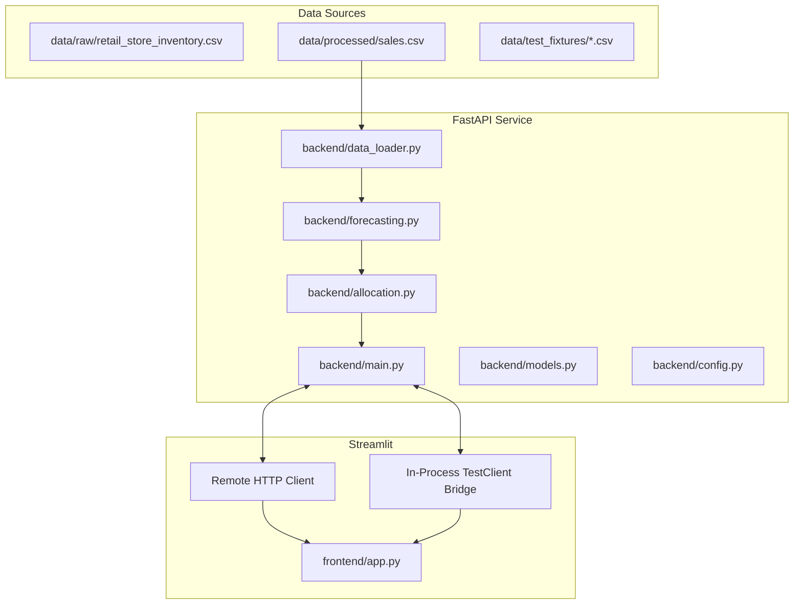

# Advanced UI & Architecture Inspection Report

**Project Title:** Advanced Inventory-Constrained Demand Forecasting and Allocation Platform  
**Inspection Date:** September 25, 2026  
**Repository:** `D:\HTH016ML04` (`jos151/HTH016ML04`)  
**Auditor:** Senior Full-Stack & Supply-Chain Optimization Engineer  

---

## 1. Executive Summary

This inspection examines the current implementation across `backend/`, `frontend/`, `data/`, `tests/`, and documentation to assess current readiness and plan the enhancement into an enterprise decision-support platform. The repository contains a working, mathematically verified foundation with 85/85 passing pytest tests. However, the frontend is currently a single-page prototype that requires modular navigation, store-SKU granular allocation, empirical confidence bands, multi-scenario lab tools, safety stock reorder planning, data-quality monitoring, secure file uploads, and enterprise Excel/CSV reporting.

---

## 2. Answers to Core Inspection Questions

1. **Frontend Technology:** Streamlit (`frontend/app.py`, Streamlit 1.64.0) with Plotly and native Streamlit charts.
2. **Existing FastAPI Endpoints:**
   - `GET /health`: Operational telemetry, store/SKU counts, date bounds.
   - `GET /forecast`: Multi-horizon forecast with promo and holiday lifts.
   - `POST /allocate`: Store-aggregated inventory allocation (`proportional` and `lp`).
   - `POST /simulate`: Side-by-side comparison of baseline vs. promo/holiday scenario.
3. **Forecasting Grain:** Forecasting operates at the granular `(store_id, sku_id, date)` level using 7-day rolling moving averages, day-of-week seasonality, and cold-start fallback.
4. **Allocation Grain:** Allocation currently aggregates demand to the **store level** (`store_id`) across SKUs. Store-SKU level allocation (`warehouse_id + sku_id + store_id + allocation_date`) is not yet implemented.
5. **Proportional Allocation:** Implemented using deterministic Hare-Niemeyer / Largest-Remainder integer distribution in `backend/allocation.py:allocate_inventory`.
6. **LP Optimization:** Implemented using PuLP branch-and-cut CBC solver in `backend/allocation.py:allocate_inventory_lp` minimizing shortage and overstock penalties.
7. **Scenario Simulation:** Implemented at API route `POST /simulate` and in frontend sidebar comparing baseline vs. adjusted scenarios.
8. **Data Retrieval via API:** Historical sales records and entity masters cannot be directly queried via dedicated REST endpoints (only summarized via `/health`).
9. **Excel/CSV Downloads:** No interactive download buttons or multi-tab Excel export utilities exist in the Streamlit UI.
10. **Incomplete or Broken Items:**
    - Lack of multi-page / multi-section navigation (Executive Dashboard, Demand Forecasting, Inventory Allocation, Scenario Simulator, Store Analysis, SKU Analysis, Model Performance, Data Quality, Reports and Exports, System Status, Settings).
    - Absence of SKU-level allocation engine with inventory templates.
    - Lack of empirical forecast confidence intervals.
    - Absence of safety-stock and reorder point recommendation analytics.
    - Absence of interactive file upload and schema validation UI.

---

## 3. Existing Architecture

---

## 4. Existing Frontend Features
- **Sidebar Parameters:** Inventory input (numeric), Horizon slider (1–30 days), Holiday toggle (+15%), Promotion store selector, Promotion multiplier slider (1.00–2.00), Allocation method selector (`proportional`, `lp`), Reset button.
- **Main View:**
  - Backend health indicator badge with in-process direct engine indicator.
  - Summary KPI cards (Total Forecast Demand, Available Inventory, Total Allocated, Total Shortage, Remaining Inventory).
  - Visual charts: Demand by store, Allocated by store, Shortage & excess by store.
  - Detailed store allocation table.
  - Tabs for Promotion Impact and Holiday Impact comparisons.

---

## 5. Existing Backend Endpoints & Models
- `GET /health` $\rightarrow$ `HealthResponse(status, data_loaded, row_count, store_count, sku_count, minimum_date, maximum_date)`
- `GET /forecast` $\rightarrow$ `List[ForecastItem(store_id, sku_id, forecast_date, baseline_units, promo_multiplier, holiday_multiplier, predicted_units)]`
- `POST /allocate` $\rightarrow$ `AllocationResponse(status, method, allocations, summary)`
- `POST /simulate` $\rightarrow$ `SimulationResponse(baseline, adjusted, demand_lift_percentage, shortage_change)`

---

## 6. Existing Analytics
- 7-day moving average baseline.
- Historical day-of-week seasonality index factors normalized to 7.0.
- Store promotion multiplier ($m \ge 1.0$) and holiday week factor ($1.15\times$).
- Largest-Remainder (Hare-Niemeyer) proportional allocation with integer rounding.
- PuLP Mixed-Integer Linear Programming (MILP) optimization.
- Holdout evaluation metrics (MAE, RMSE, WAPE).

---

## 7. Existing Tests
- `tests/test_allocation.py`: 24 tests
- `tests/test_api.py`: 18 tests
- `tests/test_data_loader.py`: 13 tests
- `tests/test_fixtures_validation.py`: 1 test
- `tests/test_forecasting.py`: 15 tests
- `tests/test_frontend.py`: 6 tests
- `tests/test_pipeline.py`: 8 tests
- **Total:** 85 passed, 0 failed.

---

## 8. Missing Advanced Features (Target Scope)
1. **Multi-Section UI Navigation System:**
   - 1. Executive Dashboard
   - 2. Demand Forecasting
   - 3. Inventory Allocation
   - 4. Scenario Simulator
   - 5. Store Analysis
   - 6. SKU Analysis
   - 7. Model Performance
   - 8. Data Quality
   - 9. Reports and Exports
   - 10. System Status
   - 11. Settings
2. **Store-SKU Level Constrained Allocation:**
   - Multi-item allocation grain: `warehouse_id + sku_id + store_id + allocation_date`.
   - Inventory-by-SKU constraints, store prioritization, and fulfillment tracking.
3. **Forecast Uncertainty & Confidence Bounds:**
   - Empirical prediction intervals $[L, U]$ derived from historical residuals.
   - Uncertainty categorization (Low, Medium, High).
4. **Safety Stock & Reorder Point Planning:**
   - Lead time demand, demand standard deviation, safety stock, reorder point (ROP), recommended reorder quantity (EOQ/ROQ), stockout risk urgency.
5. **Cost & Business Financial Analytics:**
   - Configurable unit shortage cost, holding cost, margin, lost revenue, and allocation savings.
6. **Allocation Fairness & Service Levels:**
   - Store fulfillment parity, coefficient of variation, Gini/spread fairness indicators, underserved store identification.
7. **Data Quality Monitoring & Secure Uploads:**
   - Dataset health audit, missing value checks, schema validation for custom user CSV/Excel uploads, template downloads.
8. **Multi-Tab Excel & CSV Exporting:**
   - Full multi-worksheet Excel report generation (Executive Summary, Forecast Details, Allocation Details, Store Summary, SKU Summary, Shortage Risk, Validation Checks).

---

## 9. Risks & Mitigations
| Risk | Severity | Mitigation |
| :--- | :---: | :--- |
| **Streamlit State Drift / Performance Lag** | Medium | Use st.cache_data for static dataset queries; maintain clean session state keys. |
| **Logic Duplication in Frontend** | High | Place all math (safety stock, SKU allocation, fairness, uncertainty) in backend modules; frontend only formats and displays API responses. |
| **In-Process Fallback Breakage on Cloud** | High | Ensure all new backend functions and endpoints are available via both HTTP requests and the in-process `TestClient` bridge. |
| **Solver Failure on Edge Cases** | Low | Retain automated fallback from LP to Largest-Remainder proportional allocation. |

---

## 10. Recommended Implementation Order

1. **Backend Analytics Engine Extensions:**
   - Implement empirical uncertainty calculation in `backend/forecasting.py`.
   - Implement store-SKU granular allocation with priority weighting in `backend/allocation.py`.
   - Implement safety stock and reorder point calculations in a new/extended planning module.
   - Implement business cost and fairness metrics calculation.
2. **FastAPI Endpoints & Pydantic Contracts:**
   - Add missing endpoints in `backend/main.py` and models in `backend/models.py`:
     - `GET /metadata`, `GET /stores`, `GET /skus`, `GET /categories`
     - `GET /history`
     - `POST /allocate/sku` (store-SKU allocation)
     - `POST /safety-stock`
     - `GET /data-quality`
     - `POST /reports/export`
3. **Comprehensive Automated Unit & API Tests:**
   - Add tests for SKU allocation, uncertainty bounds, safety stock, reorder points, fairness, and new endpoints.
4. **Frontend Modularization & Component Architecture:**
   - Build reusable UI components (KPI cards, alert banners, download buttons, scenario selectors).
   - Implement the 11-section navigation system in `frontend/app.py`.
5. **Comprehensive Verification & Regression Testing:**
   - Run full pytest test suite to ensure 100% backward compatibility and test coverage.
