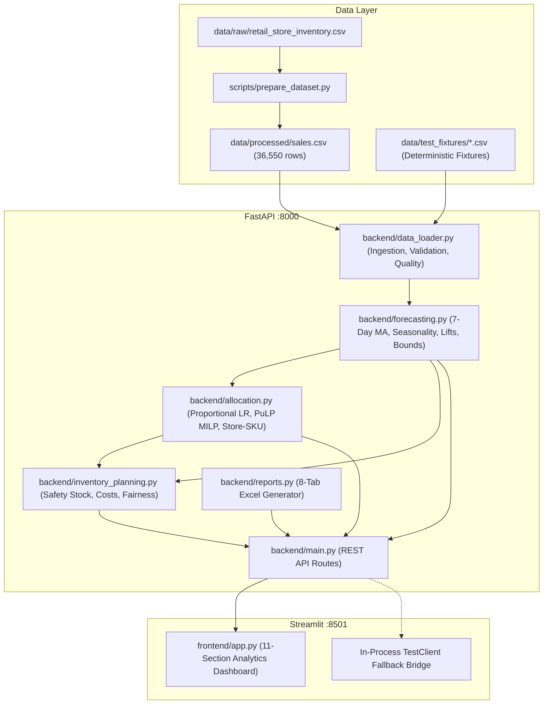

# Stage 1: Testing & Architecture Inspection Report

**Project Title:** Inventory-Constrained Demand Forecasting & Allocation Platform  
**Inspection Date:** 2026-09-25  
**Working Directory:** `D:\HTH016ML04`  
**Inspector:** Senior Quality Assurance & Systems Validation Engineer  

---

## 1. Application Architecture

The application is an enterprise retail decision-support solution implementing end-to-end demand forecasting, what-if scenario simulations, and constrained inventory allocation.

---

## 2. Core Components and Entry Points

| Dimension | Specification | Details |
| :--- | :--- | :--- |
| **Frontend Framework** | Streamlit 1.50+ | Entry point: [`frontend/app.py`](file:///D:/HTH016ML04/frontend/app.py) |
| **Backend Framework** | FastAPI 0.115+ / Uvicorn | Entry point: [`backend/main.py`](file:///D:/HTH016ML04/backend/main.py) |
| **Optimization Solver** | PuLP 2.9+ (CBC MILP) | Module: [`backend/allocation.py`](file:///D:/HTH016ML04/backend/allocation.py) |
| **Report Generation** | OpenPyXL 3.1.5 | Module: [`backend/reports.py`](file:///D:/HTH016ML04/backend/reports.py) |
| **Data Engine** | Pandas / NumPy / Scikit-Learn | Module: [`backend/data_loader.py`](file:///D:/HTH016ML04/backend/data_loader.py) |

---

## 3. Existing API Endpoints

1. `GET /health` — Health check, historical dataset date boundaries, record counts.
2. `GET /metadata` — Metadata dimensions: 5 stores, 10 SKUs, historical data span.
3. `GET /stores` — Active store IDs (`STORE_1` to `STORE_5`).
4. `GET /skus` — Active SKU identifiers (`SKU_01` to `SKU_10`).
5. `GET /forecast` — Rolling 7-day baseline demand forecast with day-of-week seasonality, promo, and holiday multipliers.
6. `GET /forecast/bounds` — Demand projections accompanied by parametric confidence intervals (80%, 90%, 95%) and risk scores.
7. `POST /allocate` — Store-level constrained allocation (Proportional largest-remainder or PuLP LP).
8. `POST /allocate/sku` — Granular multi-item store-SKU allocation with store priority weighting.
9. `POST /simulate` — Side-by-side comparison of baseline vs scenario uplift.
10. `POST /safety-stock` — Lead-time demand, safety stock ($SS = Z \cdot \sigma_d \cdot \sqrt{L}$), ROP, and MOQ batching.
11. `GET /data-quality` — Historical sales data health report (nulls, completeness, zero days).
12. `POST /reports/export` — Multi-worksheet Excel workbook generation with byte streaming.

---

## 4. Current Test Suite & Gaps

### Existing Test Files (99 Passed)
* `tests/test_advanced_features.py`: 14 tests (bounds, SKU allocation, safety stock, cost impact, fairness, Excel generation, API routes).
* `tests/test_allocation.py`: 24 tests (worked examples, scarcity, integer types, quota rounding, PuLP LP solver constraints).
* `tests/test_api.py`: 18 tests (HTTP status codes, parameter bounds, negative inventory, missing files, validation).
* `tests/test_data_loader.py`: 13 tests (loading, parsing, negative sales, missing columns, chronological sorting).
* `tests/test_fixtures_validation.py`: 1 test (fixture integrity against json metadata).
* `tests/test_forecasting.py`: 15 tests (horizons, non-negativity, multipliers, cold-starts, metrics).
* `tests/test_frontend.py`: 6 tests (API client helper methods, in-process fallback, error stringification).
* `tests/test_pipeline.py`: 8 tests (end-to-end integrity, ID survival, conservation invariants).

### Target Test Suite Structure
To meet the rigorous verification requirements across Stages 4 through 24, we will modularize and expand the test suite into dedicated domain-specific test suites:
- `test_data_validation.py` (explicit validation error tests)
- `test_forecast_metrics.py` (MAE, RMSE, WAPE, Bias, chronological splits)
- `test_priority_allocation.py` (store & SKU priority rationing)
- `test_optimizer.py` (PuLP MILP solver behavior, costs, constraints)
- `test_scenarios.py` (what-if comparative simulation matrix)
- `test_safety_stock.py` (lead times, ROP, service levels, order rounding)
- `test_cost_analysis.py` (shortage penalties, carrying costs, lost revenue)
- `test_fairness.py` (fulfillment variance, fill rate dispersion, Gini index)
- `test_api_health.py` & `test_api_forecast.py` & `test_api_allocation.py` & `test_api_simulation.py` & `test_api_uploads.py` (dedicated endpoint verification)
- `test_exports.py` (Excel 8-tab workbook verification, CSV exports)
- `test_frontend_helpers.py` (payload construction, KPI formatting, fallback)
- `test_security.py` (path traversal, input fuzzing, formula injection, negative numbers)
- `test_performance.py` (latency benchmarks, repeated requests, execution speed)

---

## 5. Potential Risks & Mitigations

1. **Proxy Interception on Localhost:**
   - *Risk:* In sandboxed or enterprise environments, `HTTP_PROXY` can intercept `127.0.0.1:8000` causing 400 Bad Request.
   - *Mitigation:* Explicitly set `NO_PROXY="localhost,127.0.0.1"` in `frontend/app.py` and `tests/conftest.py`.
2. **In-Process Fallback for Standalone Frontend:**
   - *Risk:* Streamlit Cloud or standalone execution without external Uvicorn.
   - *Mitigation:* `Starlette` `TestClient(fastapi_app)` fallback configured in `frontend/app.py`.
3. **Integer Allocation Conservation:**
   - *Risk:* Independent rounding causing sum of allocations to deviate from available inventory.
   - *Mitigation:* Hare-Niemeyer largest-remainder method strictly guarantees $\sum A_i = \min(C, \sum D_i)$.

---

## 6. Recommended Testing Order

1. **Stage 2:** Prepare environment & test suite directory structure.
2. **Stage 3:** Create/verify all 20 required deterministic test fixtures.
3. **Stages 4–12:** Unit & business logic test suites (loader, forecasting, metrics, allocation, priority, optimizer, scenarios, safety stock, cost & fairness).
4. **Stages 13–18:** API contracts, uploads, exports, data quality suites.
5. **Stages 19–24:** Frontend helpers, responsive accessibility, security, performance, end-to-end pipeline.
6. **Stages 25–27:** Full test suite run, defect log, and final completion report.
